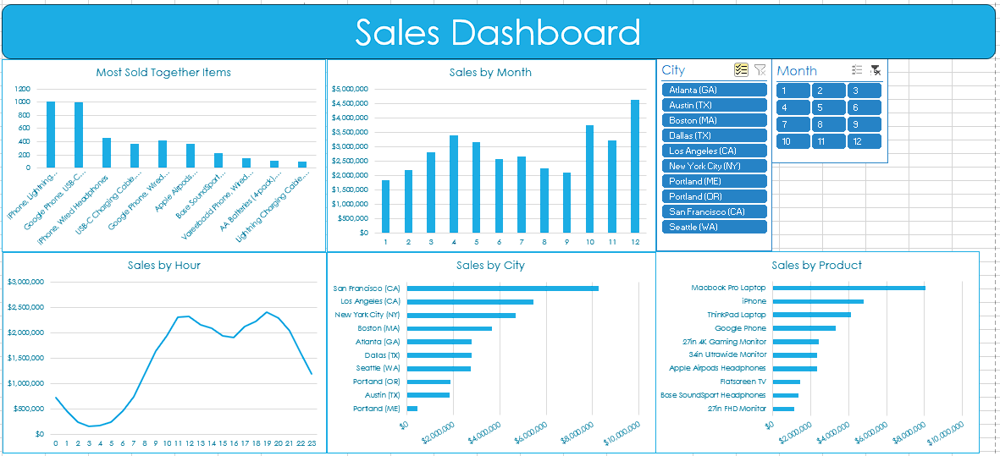

# sales_retail_stores

I answered 5 high level business questions.
   * What was the best month for sales? How much was earned that month?
   * What city sold the most products?
   * What time should we display advertisemens to maximize the likelihood of customer’s buying product?
   * What products are most often sold together?

To answer these questions the raw data was transformed using functions like Index, Textsplit, Month, Hour. 
Pivot tables (along 'sumifs' for the most sold together items) extracted useful information 
that later on was summarized and visualized on a dashboard with the help of filters to provide meaningful insights.

All_months.csv contains the raw data

